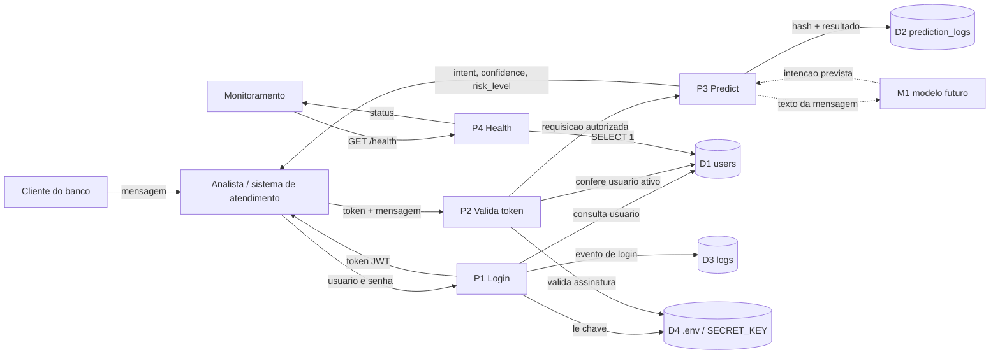

# DFD - Fintech Guard

Diagrama basico de fluxo de dados da API.

Imagem do DFD: [`dfd.png`](dfd.png)

A ideia aqui e mostrar quem envia dados, quem recebe, onde a API processa a
requisicao e onde ficam os dados salvos.

## Componentes

| ID | Tipo | Nome |
|---|---|---|
| EE1 | Entidade externa | Cliente do banco |
| EE2 | Entidade externa | Analista ou sistema de atendimento |
| EE3 | Entidade externa | Monitoramento |
| P1 | Processo | Login - `POST /auth/token` |
| P2 | Processo | Validacao do token |
| P3 | Processo | Classificacao - `POST /predict` |
| P4 | Processo | Status - `GET /health` |
| D1 | Deposito | Tabela `users` |
| D2 | Deposito | Tabela `prediction_logs` |
| D3 | Deposito | Logs da aplicacao |
| D4 | Deposito | `.env` / `SECRET_KEY` |
| M1 | Processo futuro | Modelo de classificacao |

## Diagrama

Observacao: o `M1` ainda nao existe no codigo. Hoje o `/predict` usa regras
simples. Ele aparece no DFD porque o projeto pode trocar essas regras por um
modelo treinado depois.

## Entradas e saidas

| Rota | Entrada | Saida |
|---|---|---|
| `GET /health` | sem corpo | status da API e do banco |
| `POST /auth/token` | `username` e `password` | `access_token`, `token_type`, `expires_in` |
| `GET /auth/me` | header `Authorization: Bearer` | `username`, `full_name`, `role` |
| `POST /predict` | header `Authorization: Bearer` + `message` e `channel` | `intent`, `confidence`, `risk_level`, `model_version`, `detail` |

## Trust boundaries / limites de confianca

| ID | Limite | Motivo |
|---|---|---|
| TB1 | Usuario externo -> API | Tudo que vem de fora precisa ser validado. |
| TB2 | API -> Banco | A API le e grava dados nas tabelas. |
| TB3 | API -> `.env` | A chave do JWT fica fora do codigo. |
| TB4 | API -> Modelo futuro | A mensagem do cliente pode ter dado sensivel. |

## Cuidados por limite

### TB1 - Usuario externo -> API

- validar entrada com Pydantic;
- exigir JWT no `/predict` e no `/auth/me`;
- limitar tentativas de login;
- nao devolver o texto enviado em erro de validacao.

### TB2 - API -> Banco

- usar SQLAlchemy em vez de montar SQL na mao;
- salvar senha somente com hash;
- salvar no `prediction_logs` apenas o hash da mensagem, nao o texto inteiro.

### TB3 - API -> `.env`

- deixar `.env` fora do git;
- usar `SECRET_KEY` forte;
- recusar chave de exemplo.

### TB4 - API -> Modelo futuro

- antes de usar um modelo real, mascarar dados como CPF, cartao e conta;
- aceitar somente intencoes previstas;
- tratar erro do modelo sem parar a API.

## Controles marcados na imagem

| ID | Controle |
|---|---|
| C01 | JWT com `OAuth2PasswordBearer` |
| C02 | Senha salva com hash bcrypt |
| C03 | Validacao de entrada com Pydantic |
| C04 | Limite de tentativas de login |
| C05 | Log de predicao guarda hash da mensagem, nao o texto |
| C06 | `.env` fora do git e `SECRET_KEY` forte |
